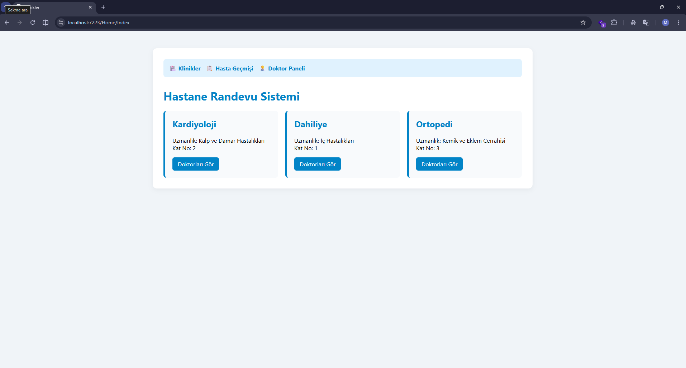
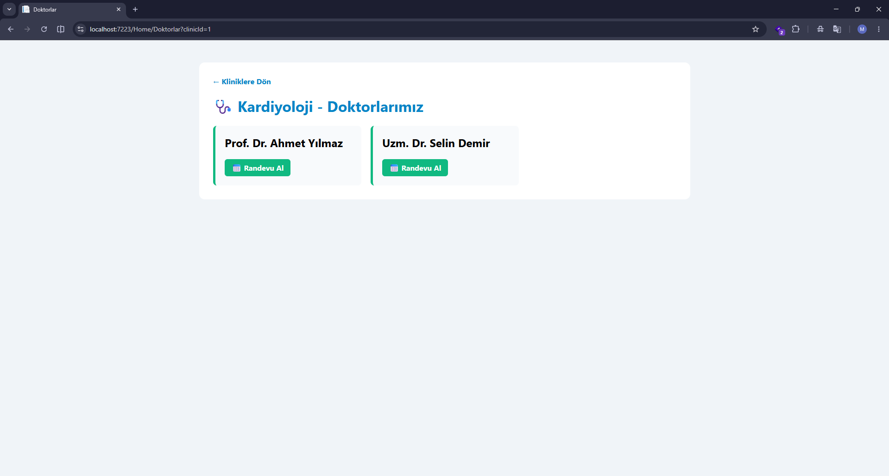
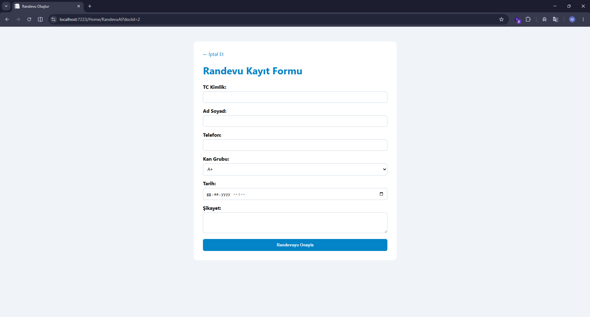
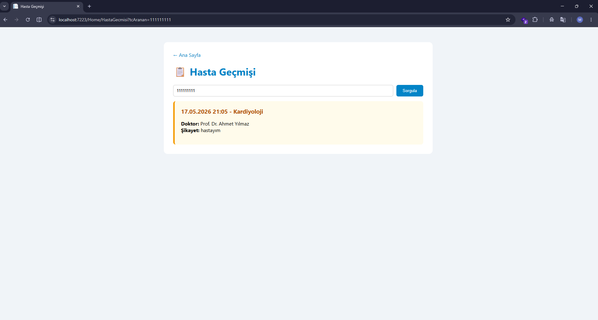
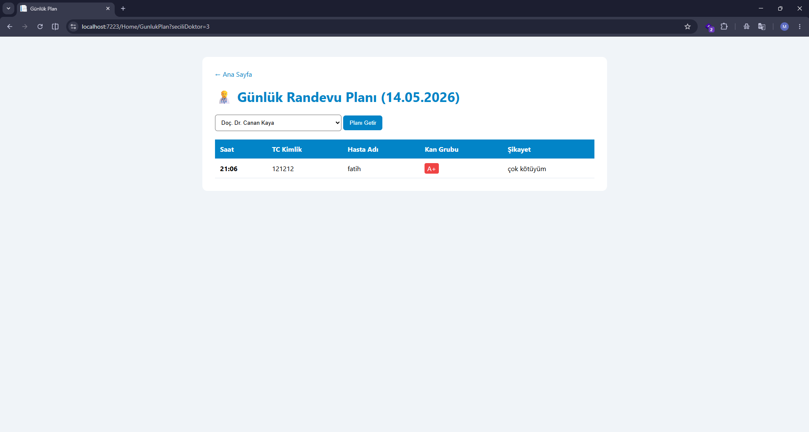
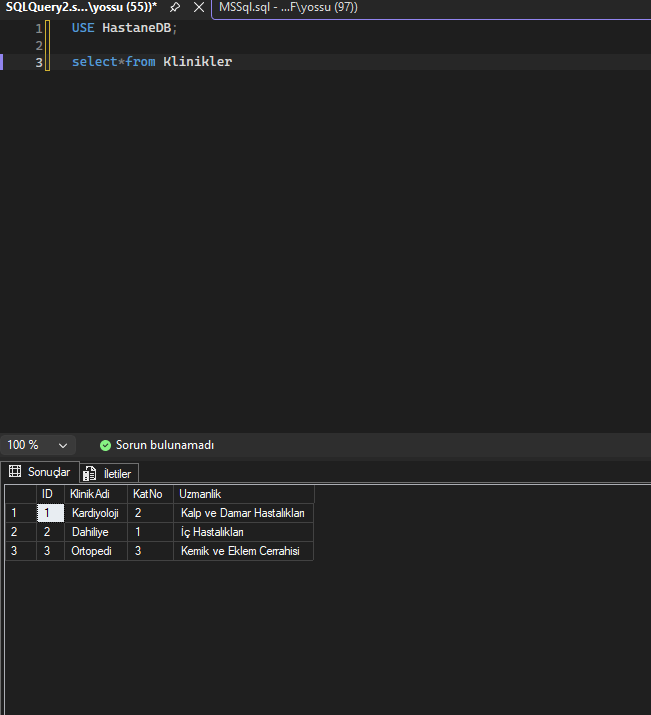
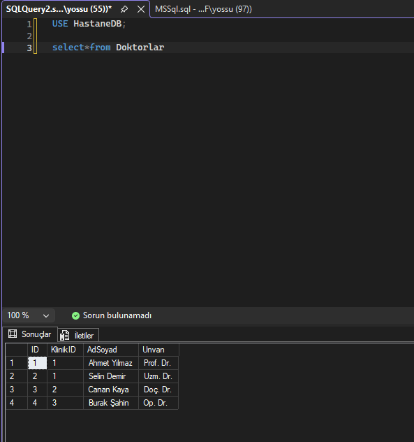
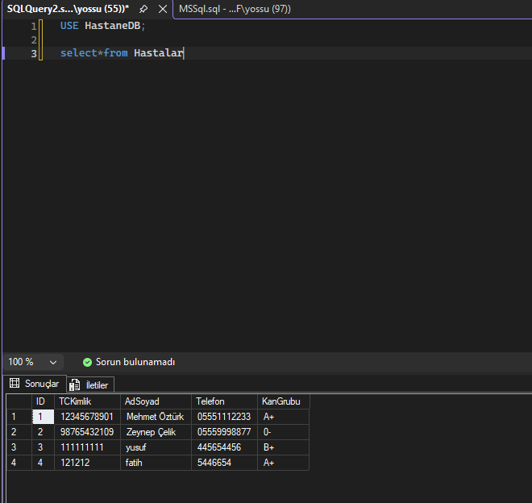
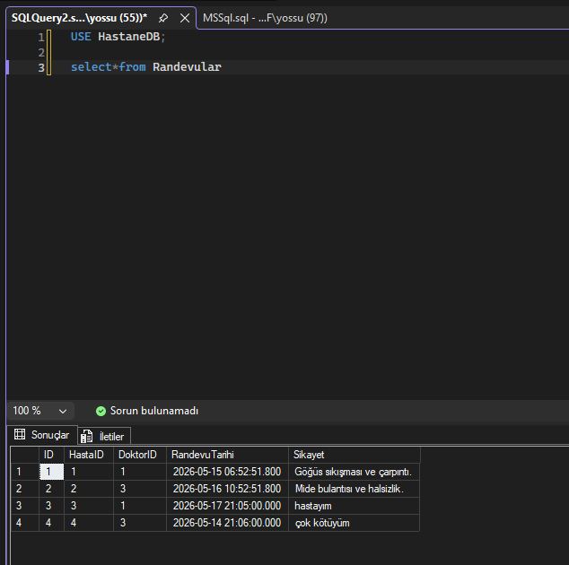
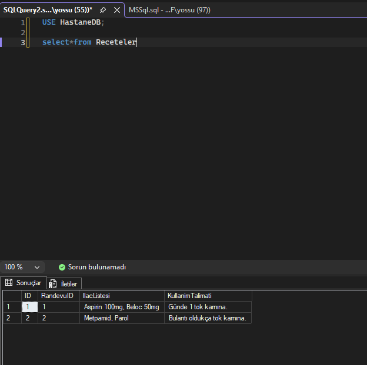

#  Hastane Randevu ve Klinik Takip Sistemi

Bu proje, "Veri Tabanı Yönetim Sistemleri" dersi kapsamında geliştirilmiş; **ASP.NET Core MVC** mimarisi ve **MS SQL Server** kullanılarak inşa edilmiş kapsamlı bir hastane otomasyon simülasyonudur.

Sistem, hasta kabulünden doktor planlamasına kadar veri tutarlılığını (Transaction yönetimi) ve ilişkisel veritabanı kurallarını (Primary/Foreign Key, Cascade Delete) katı bir şekilde uygulayarak güvenli bir veri akışı sağlar.

##  Proje Özellikleri ve Modüller

- **Klinik ve Doktor Yönetimi:** Hastanedeki birimlerin listelendiği ve seçilen kliniğe (clinicId) bağlı uzman doktorların dinamik olarak getirildiği ekranlar.
- **Akıllı Randevu Kayıt (Transaction Kontrollü):** Girilen TC Kimlik numarasıyla önce sistemde hasta olup olmadığını kontrol eden, yoksa hastayı sisteme kaydedip ardından randevuyu bağlayan tutarlı veri kayıt formu.
- **Hasta Sonuç ve Geçmişi:** Hastaların TC Kimlik numaraları ile geçmiş randevularını, doktor bilgilerini, şikayetlerini ve varsa yazılan **reçeteleri/kullanım talimatlarını** görebildikleri ekran.
- **Doktor Günlük Planı:** Doktorların kendi ID'lerine göre sistemi filtreleyip, sadece **o güne ait (GETDATE())** randevulu hastalarını, saat ve kan grubu bilgileriyle takip edebildikleri yönetim paneli.

## 📸 Uygulama Ekran Görüntüleri

### 1. Web Arayüzü (Frontend)

**Klinik Listesi (Ana Sayfa)**


**Doktor Seçim Ekranı**


**Randevu Alma Formu (Hasta Kaydı)**


**Hasta Geçmişi ve Reçete Ekranı**


**Doktor Günlük Randevu Planı**


---

### 2. Veritabanı Yapısı (MS SQL Server / SSMS)

**Klinikler Tablosu**


**Doktorlar Tablosu**


**Hastalar Tablosu**


**Randevular Tablosu**


**Reçeteler Tablosu**


##  Mimari Dosya ve Klasör Yapısı

```text
📦 ASP.NET Core MVC Proje Klasörü
 ┣ 📂 Controllers/        # Arka plan iş mantığı (HomeController.cs)
 ┣ 📂 Models/             # Veritabanı taşıyıcı sınıfları (HastaneModelleri.cs)
 ┣ 📂 Views/              # Arayüz tasarımları ve Razor sayfaları
 ┃ ┗ 📂 Home/             # (Index, Doktorlar, RandevuAl, HastaGecmisi, GunlukPlan .cshtml)
 ┣ 📂 image/              # Proje ve veritabanı ekran görüntüleri
 ┣ 📜 HastaneDB.sql       # MS SQL veritabanı kurulum scripti (DDL & DML)
 ┗ 📜 README.md           # Proje dökümantasyonu

