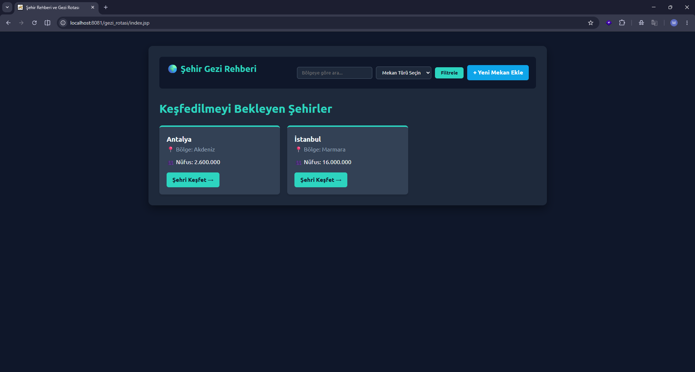
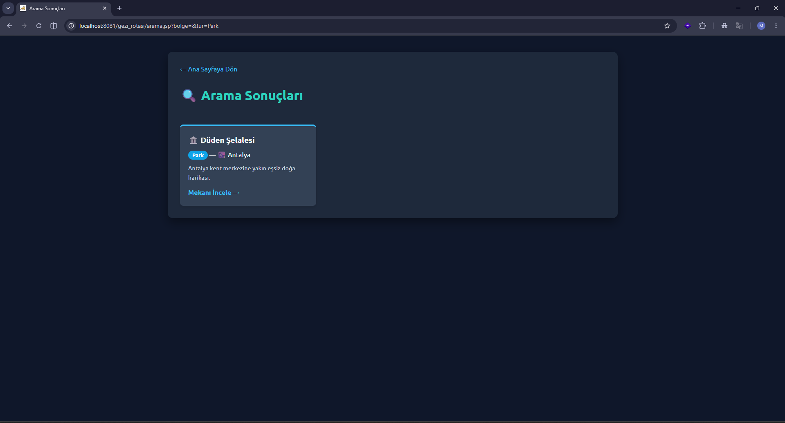
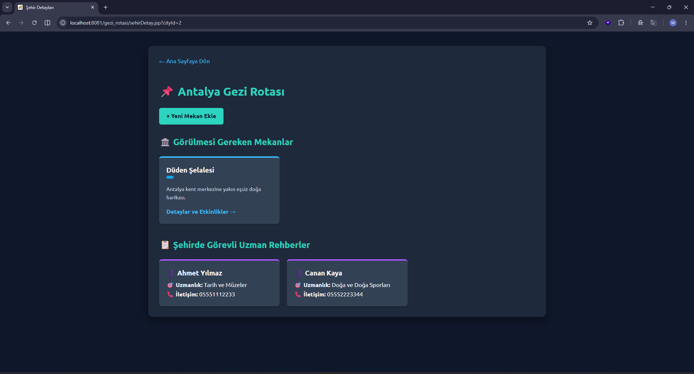
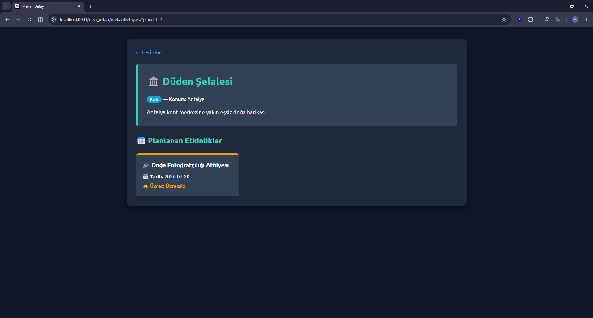
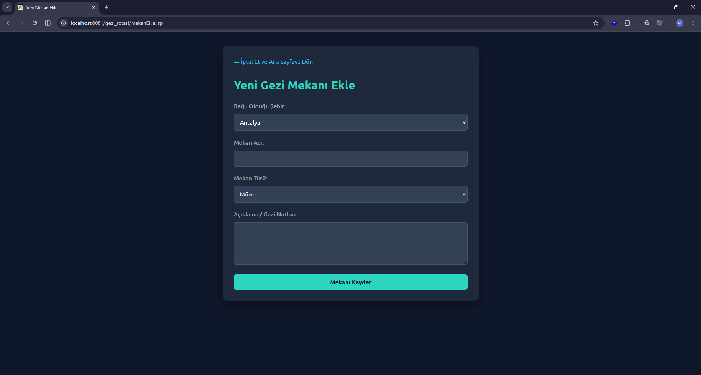
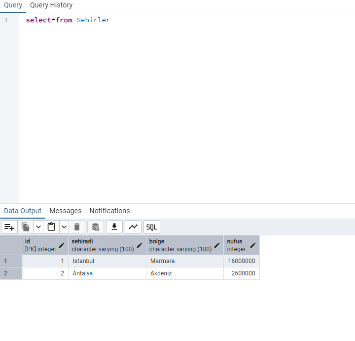
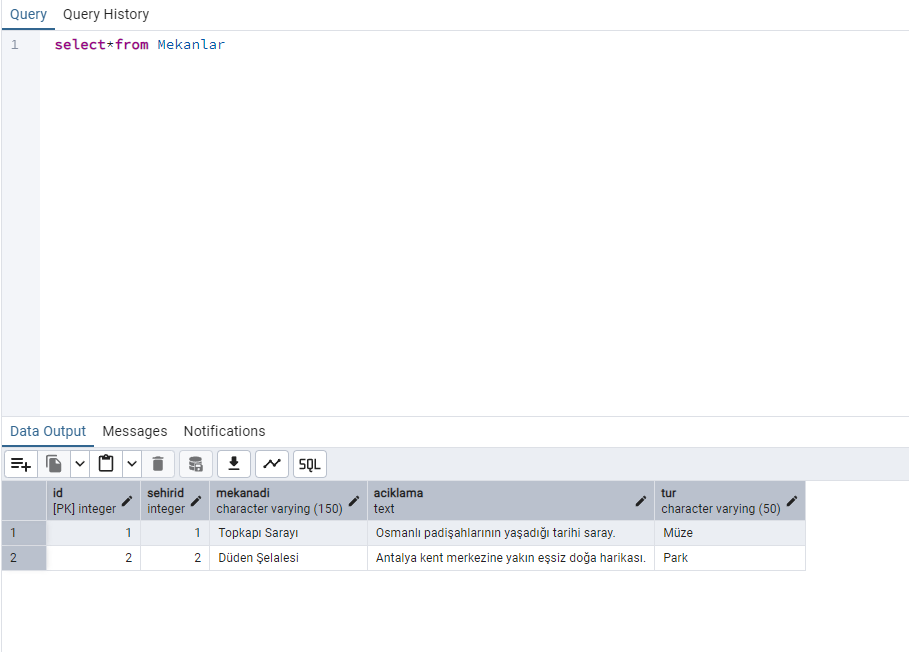
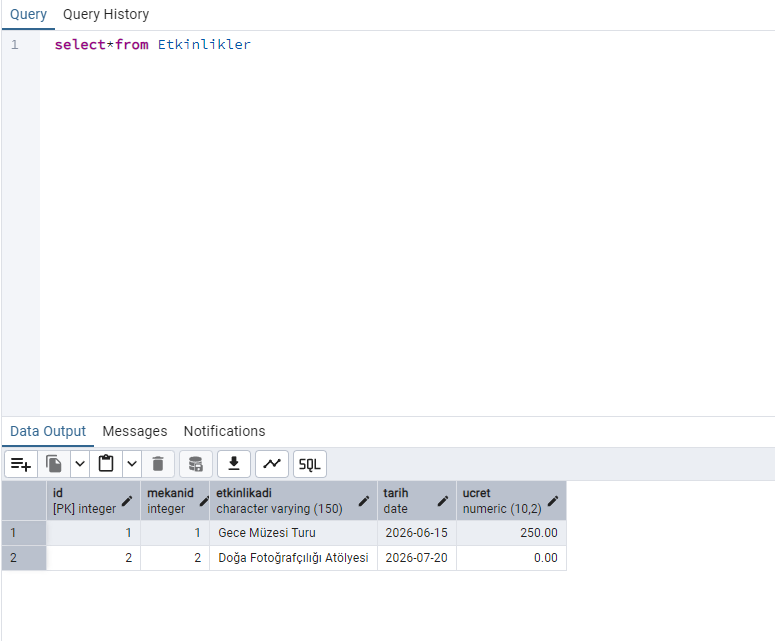
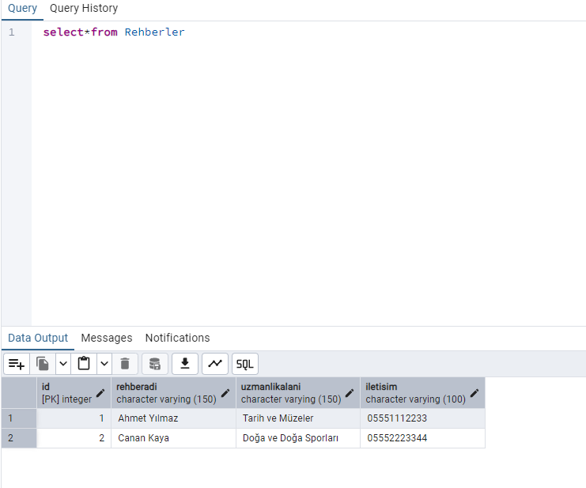
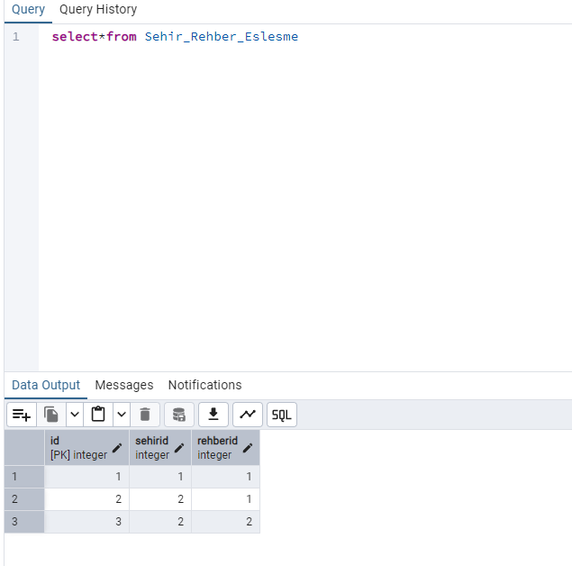

\#  Şehir Rehberi ve Gezi Rotası (JSP \& PostgreSQL)


Bu proje, "Veri Tabanı Yönetim Sistemleri" dersi kapsamında; Java Server Pages (JSP) teknolojisi ve PostgreSQL ilişkisel veritabanı yönetim sistemi kullanılarak geliştirilmiş dinamik bir seyahat ve gezi planlama platformudur.


Sistem; şehirleri, buralarda gezilmesi gereken mekanları, bu mekanlarda düzenlenen etkinlikleri ve şehirlerde görev yapan profesyonel rehberleri ilişkisel bir modelde yönetir.


\##  Proje Özellikleri (Web Ekranları)


\- \*\*Şehir Listesi (Ana Sayfa):\*\* Veritabanında kayıtlı tüm şehirlerin bölgeleri ve nüfus bilgileriyle birlikte kartlar halinde listelendiği ana giriş ekranı.

\- \*\*Şehir Detay Sayfası:\*\* Bir şehir seçildiğinde (`cityId` ile), o şehre ait görülmesi gereken mekanları (Müze, Park, Restoran) ve o şehirde aktif çalışan uzman rehberleri \*\*JOIN\*\* sorgularıyla getiren detay ekranı.

\- \*\*Mekan Detay Sayfası:\*\* Seçilen mekanın derinlemesine açıklamasını ve o mekanda gerçekleşecek dinamik etkinlik takvimini (ücret ve tarih bilgileriyle) listeleyen ekran.

\- \*\*Yeni Mekan Ekleme Formu:\*\* Seçili şehre bağımlı kalarak veya form üzerinden dinamik şehir seçimi yaparak sisteme anında yeni bir turistik mekan kazandıran CRUD formu.

\- \*\*Arama ve Gelişmiş Filtreleme:\*\* Kullanıcıların coğrafi bölgelere veya doğrudan mekan türlerine (Müze/Park/Restoran) göre arama yapmasını sağlayan dinamik sonuç sayfası.


## 📸 Uygulama Ekran Görüntüleri

### 1. Web Arayüzü (Frontend)

**Ana Sayfa - Şehir Listesi**


**Bölge ve Mekan Türüne Göre Filtreleme**


**Şehir Detay Sayfası (Mekanlar ve Aktif Rehberler)**


**Mekan Detay ve Planlanan Etkinlikler**


**Dinamik Şehir Bağlantılı Yeni Mekan Ekleme Formu**


---

### 2. Veritabanı Yapısı (PostgreSQL / pgAdmin)

**Sehirler Tablosu**


**Mekanlar Tablosu (Tür Kısıtlamalı)**


**Etkinlikler Tablosu**


**Rehberler Tablosu**


**Şehir - Rehber Eşleşme Tablosu (Many-to-Many İlişki)**


```text

📦 JSP Proje Klasörü

&#x20;┣ 📂 gezi\_rotasi/        # Tüm JSP kaynak dosyaları (index.jsp, sehirDetay.jsp vb.)

&#x20;┣ 📂 image/              # Proje arayüzü ve PostgreSQL veritabanı ekran görüntüleri

&#x20;┣ 📜 PostgreSQL.sql      # Tablo şemalarını ve test verilerini barındıran SQL dosyası

&#x20;┗ 📜 README.md           # Proje dökümantasyonu


