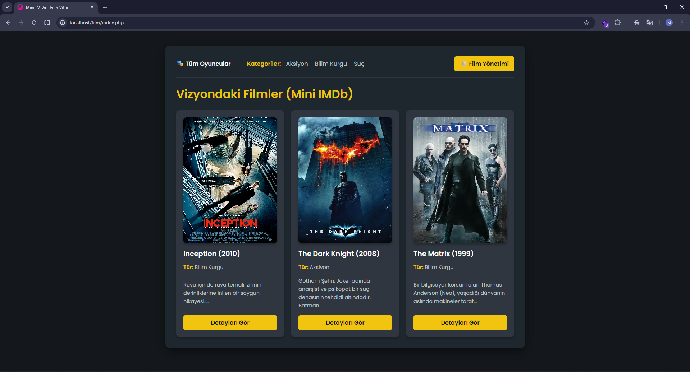
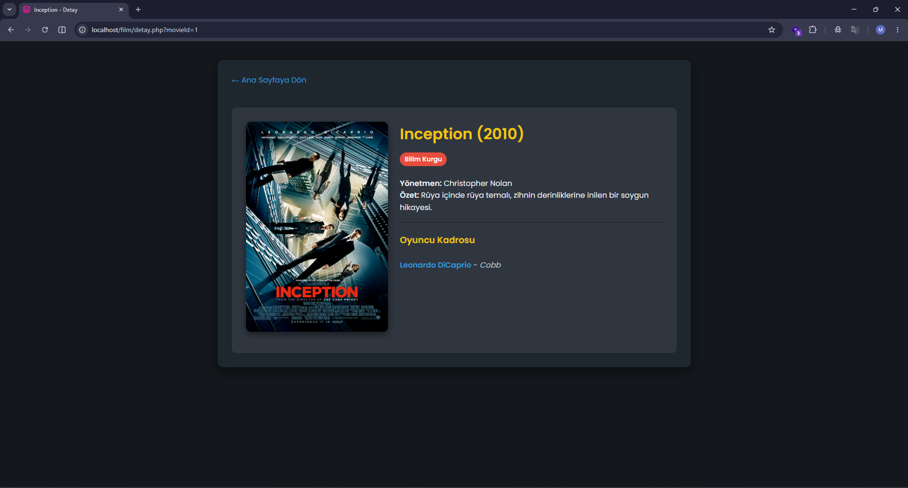
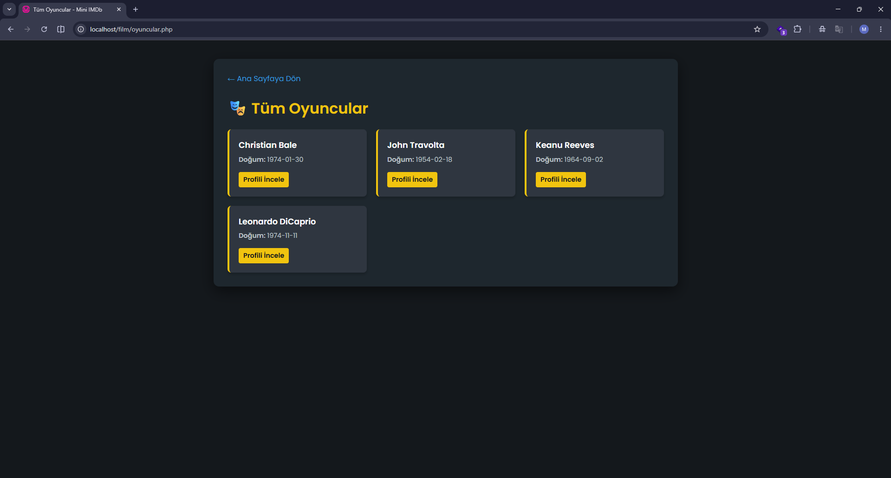
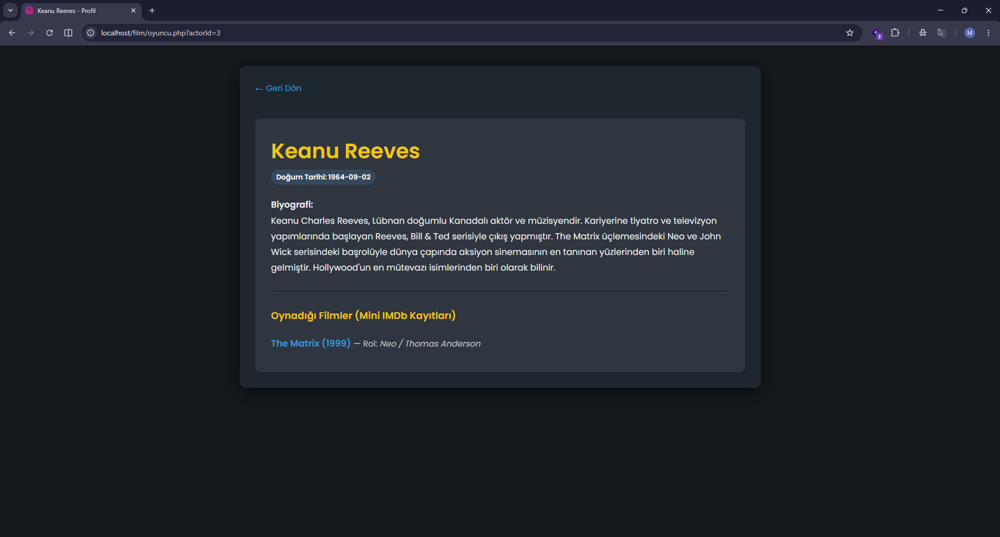
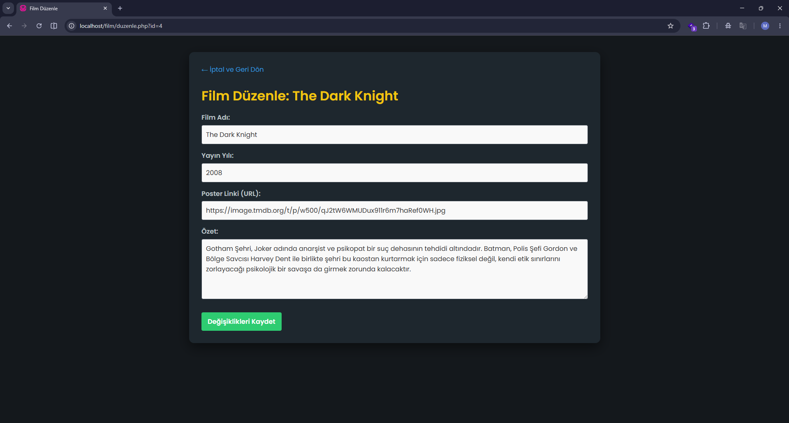
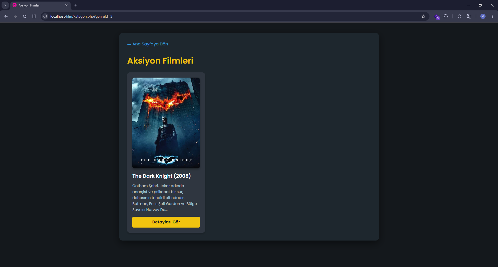
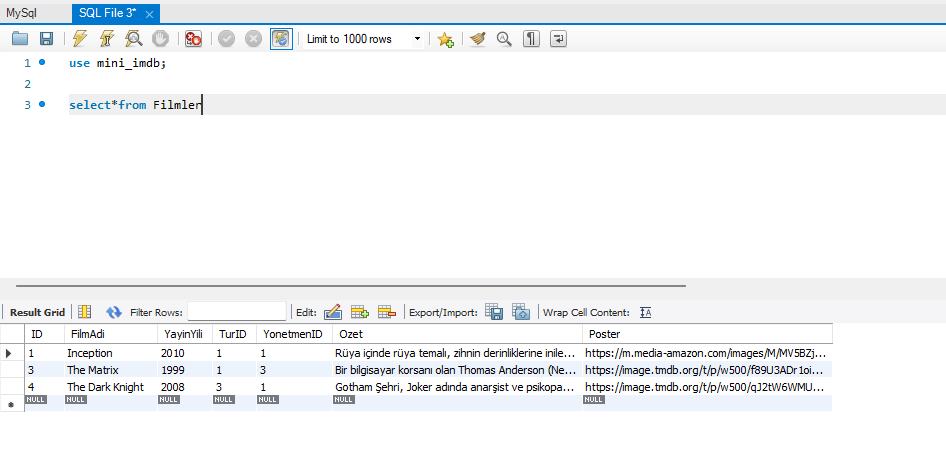
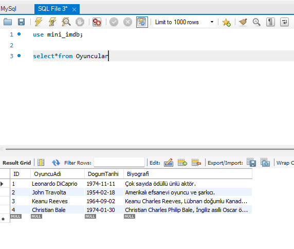
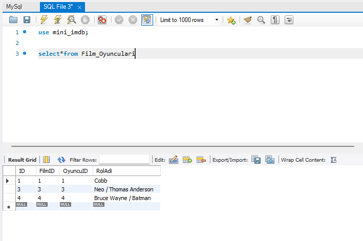
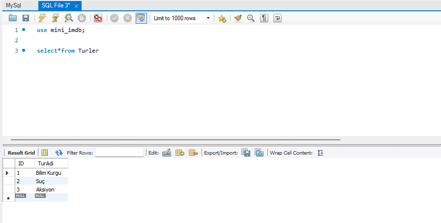

#  Film ve Oyuncu Veritabanı (Mini IMDb)

Bu proje, "Veri Tabanı Yönetim Sistemleri" dersi kapsamında; PHP, MySQL ve ilişkisel veritabanı mimarisini kullanarak geliştirilmiş bir film yönetim simülasyonudur.

## Proje Hakkında
Sistem, filmler ile oyuncular arasındaki **Many-to-Many (Çoka Çok)** ilişkiyi ve yönetmen/türler ile olan **One-to-Many (Bire Çok)** ilişkileri başarıyla yönetir. Kullanıcı dostu karanlık tema (Dark Mode) arayüzü ile veritabanındaki verilere erişim, filtreleme ve yönetim imkanı sunar.

## 📸 Uygulama Ekran Görüntüleri

### 1. Web Arayüzü (Frontend)

**Ana Sayfa - Film Vitrini**


**Film Detay Sayfası (Yönetmen & Oyuncu Kadrosu)**


**Tüm Oyuncular Listesi**


**Oyuncu Profil ve Biyografi Sayfası**


**Film Düzenleme Formu **


**Kategoriye Göre Filtreleme**


---

### 2. Veritabanı Yapısı (MySQL / phpMyAdmin)

**Filmler Tablosu**


**Oyuncular Tablosu (Uzun Biyografiler)**


**Film_Oyunculari (İlişki / Ara Tablo)**


**Türler Tablosu**



##  Dosya ve Klasör Yapısı
```text
📦 PHP Proje Klasörü
 ┣ 📂 Film/              # PHP Kaynak Dosyaları ve style.css
 ┣ 📂 image/             # Ekran Görüntüleri (Arayüz ve Veritabanı)
 ┣ 📜 MySql.sql          # Veritabanı Export Dosyası (DDL & DML)
 ┗ 📜 README.md          # Proje Dökümantasyonu

